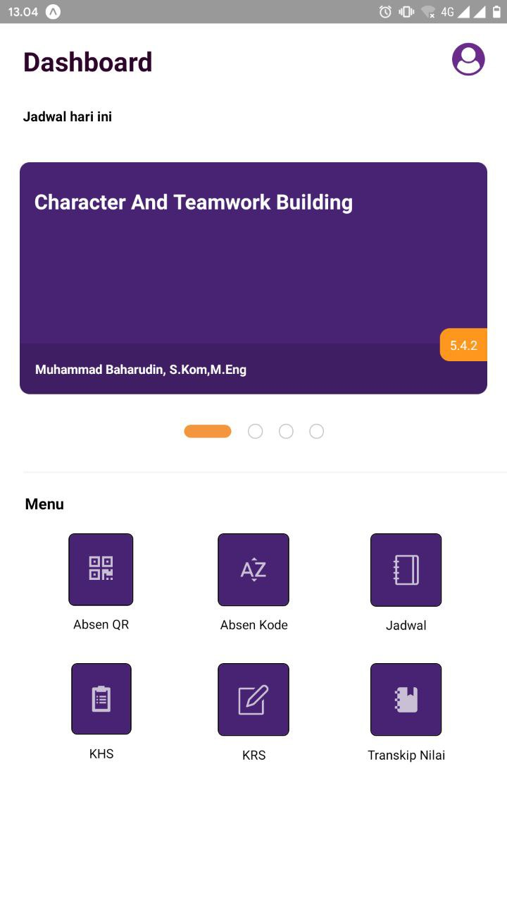

# Amikom One - React Native UI

This is the react native version of the Amikom One application. 
I can design the look of this application from:
https://medium.com/@imamfajar675/me-redesain-aplikasi-amikom-one-83e68161060d

Install the below tools/packages

| Serial No   | Software           | Version   | Installation site |
| :---------: | :----------------: | :-------: | :---------------- |
| 1           | Node.js            | >= 13.7.0  | [Install NodeJS](https://nodejs.org/en/download/) |
| 2           | npm                | >= 3.13.6 | [Install NPM](https://www.npmjs.com/get-npm)      |
| 3           | react-native       | >= 0.61.0 | [Install react-native](https://www.npmjs.com/package/react-native) |
| 4           | react-native-cli   | >= 2.0.1  | [Install react-native-cli](https://www.npmjs.com/package/react-native-cli) |
| 5           | exp                | >= 55.0.5 | [Install Expo](https://www.npmjs.com/package/exp) |

### Setup Instructions

#### System setup
1. Clone the repo with `git clone [REPO_URL]` command
2. Switch to the project's root directory in terminal
3. Install the dependencies by running `yarn install`
4. Once, 'yarn install' is completed, run `exp start` to start the expo and react-native server
5. If it shows a QR code on the terminal as a result of 'exp start' command, then you are good to go!

Ignore the first step on 'Mobile setup' instructions given below if you already have 'Expo' app installed on your phone.

#### Mobile setup
1. Install 'Expo' application on your android/iOS device. You can find the links to Android and iOS apps [here](https://expo.io/tools#client).
2. Scan the QR code shown on the terminal.
3. Once the QR code is successfully scanned, it will take few seconds to load and render the app.
